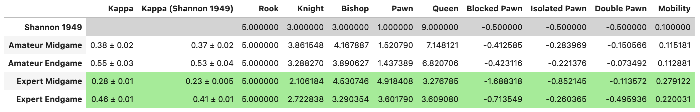
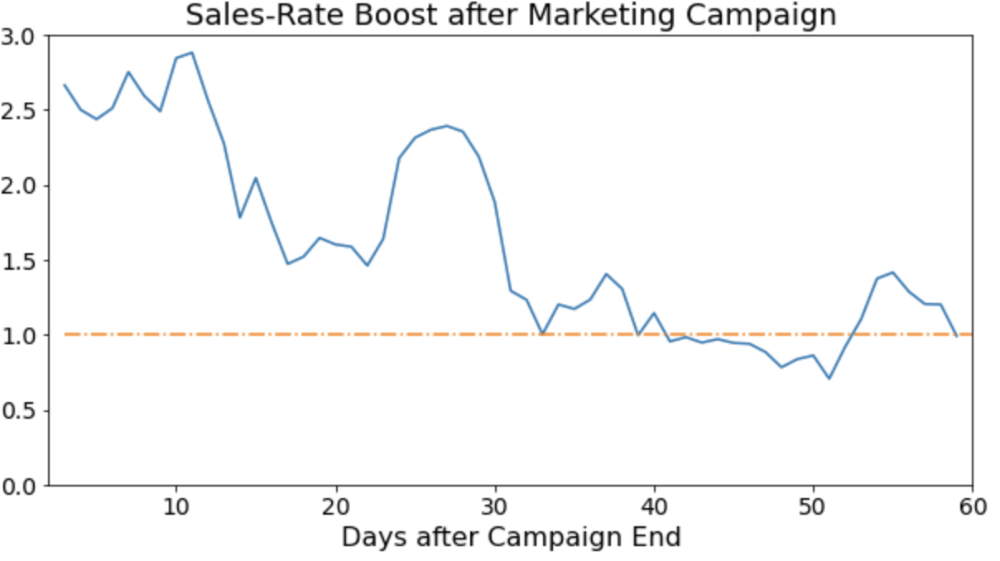
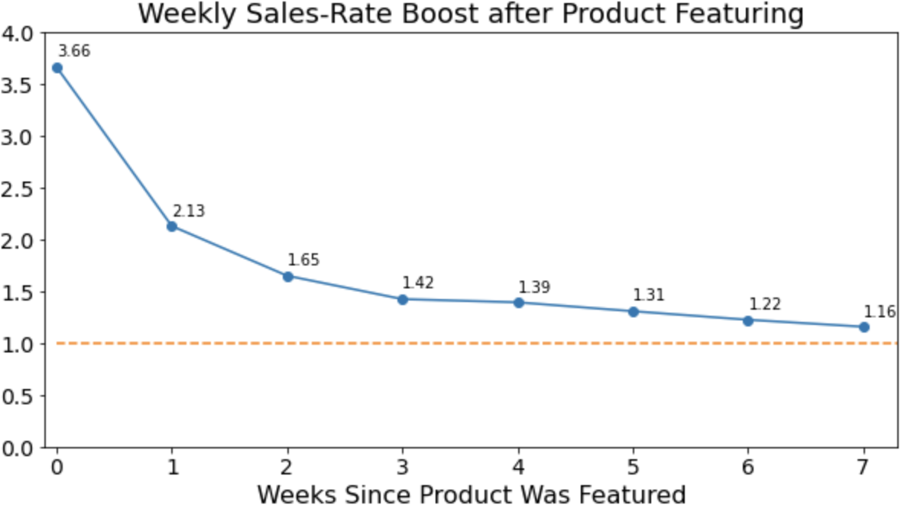

# Data Science Projects
This repository contains a sample of data science projects completed by me. 

## [Amazon Product Quality Report](https://github.com/alexmousatov/amousatov/blob/main/amazon_reviews.ipynb)
I scrape and clean Amazon review and rating data for multiple products, with the aim of creating a concise, customer-friendly report on the product. The report is intended to give the potential customer a balanced understanding of the positive and negative features of each product. It provides brief, informative snippets of customer reviews, while filtering out purely sentimental statements.
* I identify the probable presence of unreliable product quality and/or fraudulent reviews, using a chi-squared test. 
* I extract keywords used by happy versus unhappy uncustomers, with an emphasis on keywords that express concrete features of the product, while excluding uninformative sentimental keywords. 
* I produce an automated, concise report on product pros and cons.

Methods used: data scraping (requests, beautifulsoup), statistical analysis (chi-squared test), keyword extraction (term frequencies, bag of words, lemmatization, stopwords) 

## [Chess Piece Valuation](https://github.com/alexmousatov/amousatov/blob/main/chess_piece_valuation.ipynb)

Almost anyone who has played chess knows the traditional point values for chess pieces: 9 points for a queen, 5 for a rook, 3 for a bishop or knight, and 1 for a pawn. There are many possible expansions to this point score; for example, C. Shannon (1949) added an extra 0.1 points for every legal move to represent mobility, and a -0.5 points penalty for every badly positioned pawn. These point scores are thought to express the strength of the White versus Black player at any point in the game. More points should mean that the player is more likely to win. 

I test this heuristic; do more points in this traditional scoring system mean a higher chance of victory? I collect and clean the data for chess games between (i) experts playing in tournaments and (ii) amateurs playing online. I apply logistic regression to predict which players win a game, using the same feature space defined by C. Shannon: piece counts, mobility, and bad pawns. The fitted model's coefficients define the point values logistic regression assigned to each feature. The results are shown in the figure below, where 'Kappa' refers to the evaluation metric with the fitted coefficients and 'Kappa (Shannon 1949)' refers to the evaluation metric when making predictions based on the Shannon 1949 coefficients in the first row. 

I find that the traditional scoring system works excellently for amateur games, but that the point scores assigned by logistic regression work better for expert games. The fitted model produces incredibly counterintuitive results: how can a rook or a pawn ever be worth more than a queen?! As outrageous as this result is, our evaluation metric, Cohen's kappa score, shows that the fitted model's point score, which consistently assigns more points to a rook than a queen, is a stronger predictor of victory. 

We need to make a subtle distinction to make sense of this result. If any player makes a strategy of sacrificing queens for pawns, they will lose. But the point score needed to *predict* victory, in a serious tournament game between world class players, is not the same thing as the point score meant to *guide action* in a game. These players won't sacrifice a queen unless it gives them serious compensating benefits, in the form of other pieces or a much more advantageous position. It is fascinatingly bizarre that the point scores should be so different than expected, but there is no fundamental contradiction. The strategy and tactics of the best chess players reliably betray a sensible piece valuation. 

*Methods used in project: data cleaning, feature engineering, logistic regression, XGBoost*

## [Advertising Analysis of a Grocery Store Retailer](https://github.com/alexmousatov/amousatov/blob/main/advertising_grocery_store.ipynb)

I analyze a national grocery retailer's household-level transaction history, and I make conclusions that would aid the retailer's advertising efforts. 

* I performed a customer segmentation that identified four distinct clusters based on purchasing patterns. The highest-spending customers are primarily two-adult households with a higher typical income at \$87,000. The lowest-spending but highest-growth customers tend to be younger adults with a lower typical income at \$42,000. The retailer will likely gain the most returns by investing in more advertising to the lowest-spending but highest-growth cluster, to ensure they continue increasing their spending. 

* Marketing campaigns using coupons have positive effects even after the campaign is over. Sales are boosted for 30 days (see left figure), and 20% of households re-buy products that they tried for the first time using a coupon. 

* Product displays in special locations, like in-store or in the weekly mailer, boost sales by a factor of 3.66 on average. The featured products continue to be bought at an elevated rate for about 50 days (see right figure). The highest value display locations are the store front, with a 7-times boost in sales, and the front-page of the weekly mailer, with a 6.5-times boost in sales. 

    

Methods used: data manipulation (pandas), dimensional reduction (PCA), clustering (KMeans)

## [Cryptocurrency Forecasting](https://github.com/alexmousatov/amousatov/blob/main/cryptocurrency_forecast.ipynb)
I create a forecasting model for fifteen-minute price movements of popular cryptocurrency assets. 
* I examine statistical properties of the time series, specifically autocorrelation and stationarity, to inform my modeling. 
* I engineer a number of features, including popular technical financial indicators, as well as rolling averages and first and second derivatives of various features.
* I perform feature-selection using Pearson correlations and feature importances. 
* I fit to an XGBoost model, and compare performance with persistence model and linear regression baselines.

My forecasting model produces a weighted correlation value of 0.049. By typical standards for forecasting models, this result is pitifully low. But this is not a typical forecasting problem for a number of reasons. 
* The efficient market hypothesis states that any strategy leading to reliable profits (like a more accurate forecasting model) is impossible.
* Cryptocurrences are wildly volatile. 
* The prediction target is the fifteen-minute log return, subtracted by a term that accounts for general market behavior. Overall market trends are therefore useless for forecasting. 

Methods used: statistical analysis (Dickey-Fuller test, autocorrelations), feature engineering (financial technical indicators, lags, rolling statistics), feature selection (Pearson correlations, feature importance), gradient-boosting trees (XGBoost). 
